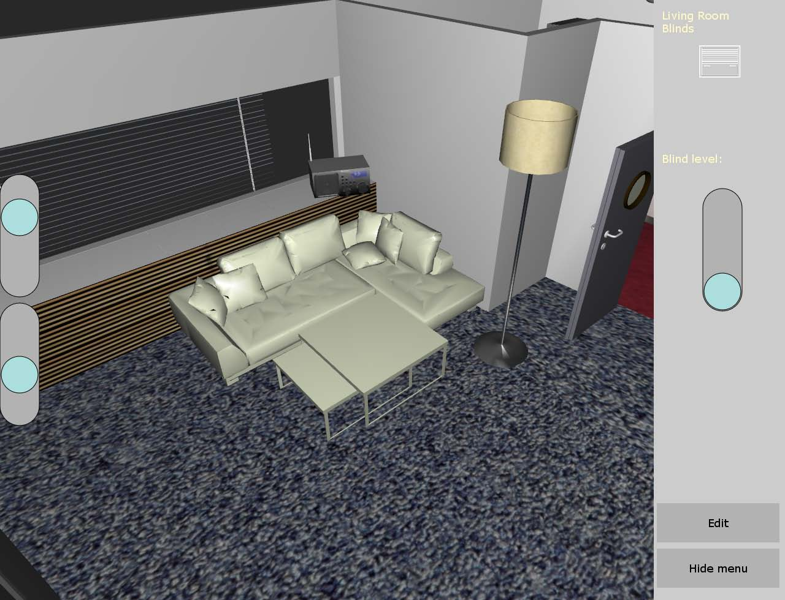

# Bachelor-Thesis
My bachelor's thesis, the thesis presentation and the implementation, the `SmartHomeGUI`.
- author: Andreas Langenhagen (andreas@langenhagen.cc)
- version: 19-05-05

**This project is not maintained anymore.**

The `SmartHomeGUI` is a 3D GUI framework and smart home application based on `MT4J`
(http://www.mt4j.org) and the smart home API `MASP`
(http://www.dai-labor.de/en/ngs/completed_projects/masp/).
In the course of this work, I created a GUI Framework, the GUI widgets, 3D models, the UI and the
application.
The project is written in `Java`.

*A screenshot of the view into the application*

My bachelor's task was the implementation of a 3D smart home GUI in order to learn about the fit of
this kind of GUI into the smart home context.

The thesis was completed at the DAI Labor (https://www.dai-labor.de) in 2012.
The project was successful in the sense that it found great overall acceptance and a  new commercial
iteration of the software has been written based on my work.
